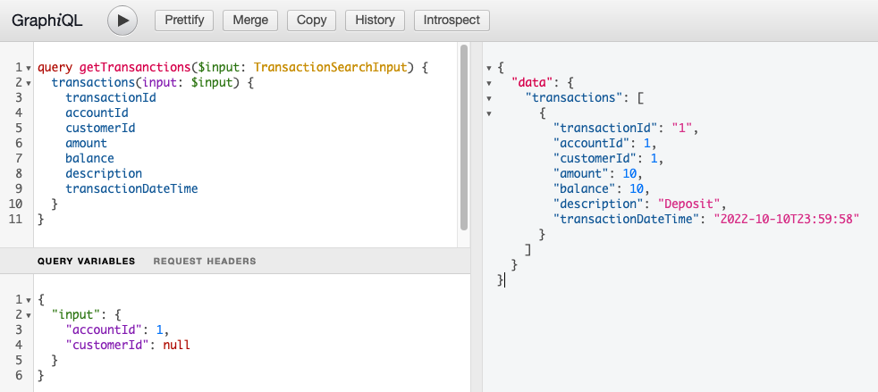

# Spring GraphQL Playground

This repository contains the demo code for implementing a GraphQL API using the Spring GraphQL library. This implementation is used to learn the following GraphQL concepts:
- Use of extended scalars such as DateTime, BigDecimal with the help of [graphql-java-extended-scalars](https://github.com/graphql-java/graphql-java-extended-scalars)
- Unit and Integration tests using the [Spring GraphQL Testing](https://docs.spring.io/spring-graphql/docs/current-SNAPSHOT/reference/html/#testing) support
- API Error handling with custom responses

## Getting started

- Start the application from the console entering the command from the root of the project

    ```shell
    ./mvnw spring-boot:run
    ```

- Open the browser and access the url http://localhost:8080/graphiql to start the [GraphiQL](https://github.com/graphql/graphiql) in-browser IDE

  - To get the list of Transactions for the accountId `1` use the following query
    
   ```
    query getTransanctions($input: TransactionSearchInput) {
      transactions(input: $input) {
        transactionId
        accountId
        customerId
        amount
        balance
        description
        transactionDateTime
     }
   }
   ```
  with the following variables defined in the Query Variables section

  ```text
    {    
       "input": {
         "accountId": 1,
         "customerId": null
       }
    }
  ```
  as seen in the screenshot sample below: 

  


## Domain

The domain for this demo represents a very minimal Banking Account Transactions scenario.

| Domain        | Description                                                                                                                                                               |
|---------------|---------------------------------------------------------------------------------------------------------------------------------------------------------------------------|
| `Customer`    | Bank Account Holder, includes personal details such as First Name, Last Name etc                                                                                          |
| `Account`     | Bank Account, many-to-many relationship with the `Customer` domain. includes the type of Account (`SAVINGS`, `CHECKING`) and the latest balance amount                    |
| `Transaction` | Transaction history for a given account/customer. Includes details such as type of transaction(`DEPOSIT`,`WITHDRAW`), amount, updated balance, transaction timestamp etc. |
